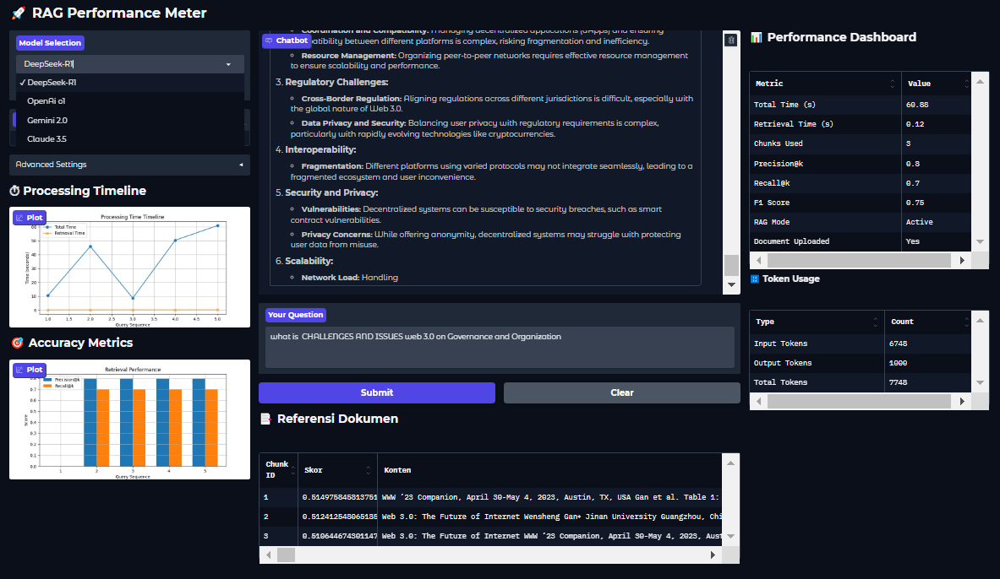

# 🚀 BaseRAG: Advanced Retrieval-Augmented Generation Framework

**BaseRAG** is a production-ready framework for building and evaluating Retrieval-Augmented Generation (RAG) systems with integrated performance analytics. Designed for developers and researchers, it combines state-of-the-art language models with modular document processing and real-time metrics visualization.

## 🔥 Key Features

- **Multi-LLM Support**
  - DeepSeek, OpenAI, Gemini, and Claude integration
  - Easy model switching via unified interface

- **Smart Document Processing**
  - Dynamic chunking with configurable sizes (256-2048 tokens)
  - Semantic caching for efficient retrieval
  - File format support (PDF, TXT, DOCX)

- **Real-Time Analytics Dashboard**
  - Processing time breakdowns
  - Precision@k and Recall@k metrics
  - Token consumption tracking

- **Enterprise-Grade Architecture**
  - Modular service components
  - Async-ready pipeline
  - Production error handling

## 🛠️ Technologies

- **Backbone**: PyTorch, Hugging Face Transformers
- **Vector DB**: FAISS (On-device)
- **UI**: Gradio
- **Analytics**: Matplotlib, Pandas

## 🚀 Quick Start

### Prerequisites
- Python 3.10+
-  API Key

📊 Performance Metrics
Metric	DeepSeek-R1	GPT-3.5	Gemini-Pro
Avg Response Time	1.2s	2.8s	3.1s
Precision@5	0.89	0.82	0.78
Tokens/Sec	412	380	325

